<div align="center" id="top">
  <h2>
    <i>Developer Full Stack</i>
  </h2>
  <a href"https://github.com/strangeoficial?tab=followers">
        
   </a>
  <a href="https://twitter.com/strange_silva">
     
  </a>
  <a href="https://discord.gg/5dZPVytKnn">
    
  </a>
</div>

<br />

<div style="width: 10px;"></div>
<a  href="https://discord.gg/5dZPVytKnn"></a>

```typescript
import { message } from "howstrange";

class StrangeWorkflow {
  private message: string[];
  
  contructor() {
    this.message = ["ts", "js", "py", "c"]
  };
  
  public async function SendMessage(): Promise<string> {
    const send = await message();
    
    const msg = send(this.message);
    
    return msg;
  };
};

export { StrangeWorkflow };
``` 

<h4 align="center">


